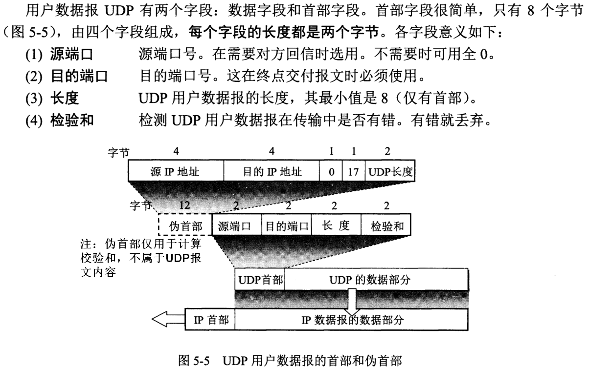
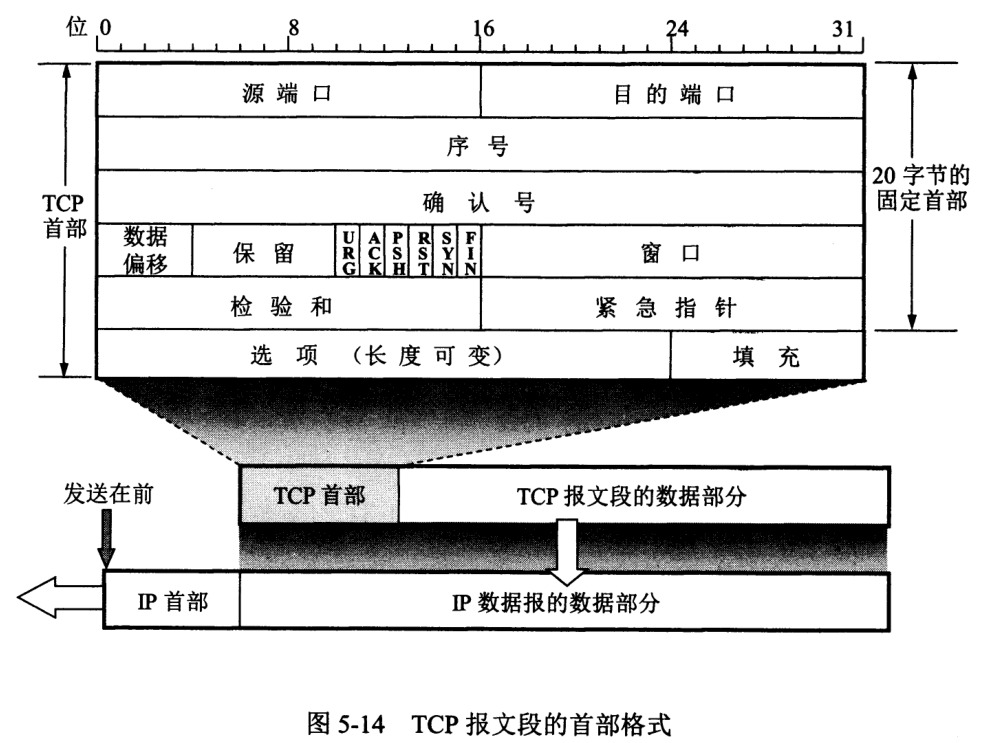
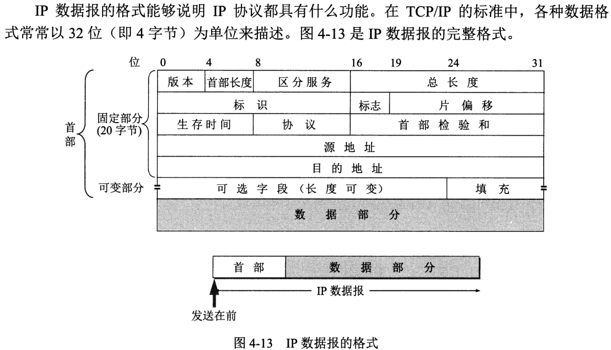
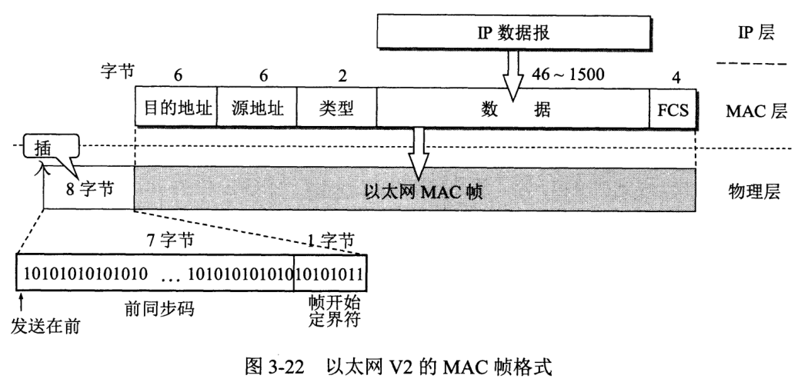
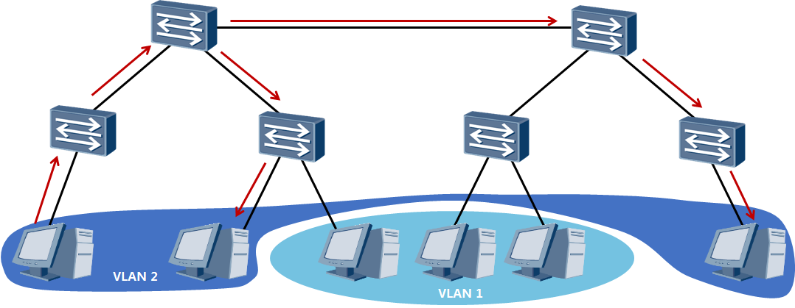
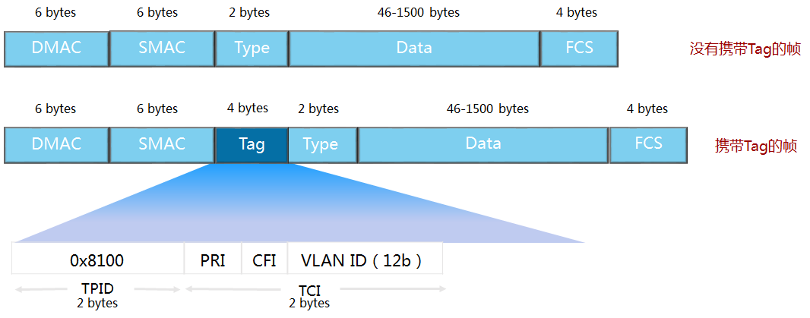

<!-- TOC -->

- [TCP/IP协议简介](#tcpip协议简介)
- [应用层](#应用层)
- [传输层](#传输层)
- [网络层](#网络层)
- [数据链路层](#数据链路层)
- [物理层](#物理层)
- [扩展](#扩展)

<!-- /TOC -->

## 1. TCP/IP协议简介
互联网协议族（Internet Protocol Suite，缩写IPS）是一个网络通信模型。它常被通称为**TCP/IP协议族**。由于在网络通讯协议普遍采用分层的结构，当多个层次的协议共同工作时，类似计算机科学中的堆栈，因此又被称为**TCP/IP协议栈**

TCP/IP是一个四层体系结构，它从高到低包括**应用层、运输层、网际层和网络接口层**。高层逻辑上与用户更为接近，所处理数据更为抽象，它们依赖于低层将数据转换成最终能够进行实体控制的形式。

TCP/IP提供点对点的链接机制，将数据应该如何封装、定址、传输、路由以及在目的地如何接收加以标准化。常被称为简化的七层OSI模型。

    注：五层协议的体系结构只是为了讲解网络原理而设计的，实际应用还是TCP/IP四层体系结构。

## 2. 应用层

提供OSI用户服务，即确定进程之间通信的性质，以满足用户需要以及提供网络与用户应用软件之间的接口服务。

一些特定的程序被认为运行在这个层上。它们提供服务直接支持用户应用。这些程序和它们对应的协议包括[HTTP](https://zh.wikipedia.org/wiki/%E8%B6%85%E6%96%87%E6%9C%AC%E4%BC%A0%E8%BE%93%E5%8D%8F%E8%AE%AE "超文本传输协议")（万维网服务）、[FTP](https://zh.wikipedia.org/wiki/%E6%96%87%E4%BB%B6%E4%BC%A0%E8%BE%93%E5%8D%8F%E8%AE%AE "文件传输协议")（文件传输）、[SMTP](https://zh.wikipedia.org/wiki/%E7%AE%80%E5%8D%95%E9%82%AE%E4%BB%B6%E4%BC%A0%E8%BE%93%E5%8D%8F%E8%AE%AE "简单邮件传输协议")（电子邮件）、[SSH](https://zh.wikipedia.org/wiki/Secure_Shell "Secure Shell")（安全远程登陆）、[DNS](https://zh.wikipedia.org/wiki/%E5%9F%9F%E5%90%8D%E7%B3%BB%E7%BB%9F "域名系统")（名称<-> IP地址寻找）以及许多其他协议。 一旦从应用程序来的数据被编码成一个标准的应用层协议，它将被传送到IP栈的下一层。

每一个应用层协议一般都会使用到两个传输层协议之一： 面向连接的[TCP传输控制协议](https://zh.wikipedia.org/wiki/%E4%BC%A0%E8%BE%93%E6%8E%A7%E5%88%B6%E5%8D%8F%E8%AE%AE "传输控制协议")和无连接的包传输的[UDP用户数据报文协议](https://zh.wikipedia.org/wiki/%E7%94%A8%E6%88%B7%E6%95%B0%E6%8D%AE%E6%8A%A5%E5%8D%8F%E8%AE%AE "用户数据报协议")。

**1). TCP对应的应用层协议**

 **FTP**：定义了文件传输协议，使用21端口。常说某某计算机开了FTP服务便是启动了文件传输服务。下载文件，上传主页，都要用到FTP服务。

**Telnet**：它是一种用于远程登陆的端口，用户可以以自己的身份远程连接到计算机上，通过这种端口可以提供一种基于DOS模式下的通信服务。如以前的BBS是-纯字符界面的，支持BBS的服务器将23端口打开，对外提供服务。

**SMTP**：定义了简单邮件传送协议，现在很多邮件服务器都用的是这个协议，用于发送邮件。如常见的免费邮件服务中用的就是这个邮件服务端口，所以在电子邮件设置-中常看到有这么SMTP端口设置这个栏，服务器开放的是25号端口。

**POP3**：它是和SMTP对应，POP3用于接收邮件。通常情况下，POP3协议所用的是110端口。也是说，只要你有相应的使用POP3协议的程序（例如Fo-xmail或Outlook），就可以不以Web方式登陆进邮箱界面，直接用邮件程序就可以收到邮件（如是163邮箱就没有必要先进入网易网站，再进入自己的邮-箱来收信）。

**HTTP**：从Web服务器传输超文本到本地浏览器的传送协议。

**2). UDP对应的应用层协议**

**DNS**：用于域名解析服务，将域名地址转换为IP地址。DNS用的是53号端口。

**TFTP**(Trival File Transfer Protocal)：简单文件传输协议，该协议在熟知端口69上使用UDP服务。

**SNMP**：简单网络管理协议，使用161号端口，是用来管理网络设备的。由于网络设备很多，无连接的服务就体现出其优势。

## 3. 传输层

传输层能够解决诸如端到端可靠性（“数据是否已经到达目的地？”）和保证数据按照正确的顺序到达这样的问题。在TCP/IP协议组中，传输协议也包括所给数据应该送给哪个应用程序。

该层主要使用**TCP（传输控制协议）**和**UDP（用户数据报协议）**这两个协议。

**UDP报文段结构：**

**TCP报文段结构**

## 4.网络层

网络层提供**路由和寻址**的功能，使两终端系统能够互连且决定最佳路径，并具有一定的拥塞控制和流量控制的能力。由于TCP/IP协议体系中的网络层功能由IP协议规定和实现，故又称IP层。

**IP数据报格式：**

## 5. 数据链路层

负责在两个相邻结点间的线路上，无差错地传送以帧为单位的数据，并进行流量控制。每一帧包括一定数量的数据和一些必要的控制信息。与物理层相似，数据链路层要负责建立、维持和释放数据链路的连接。

**以太网MAC帧格式**

## 6. 物理层

物理层规定:为传输数据所需要的物理链路创建、维持、拆除，而提供具有机械的，电子的，功能的和规范的特性。简单的说，物理层确保原始的数据可在各种物理媒体上传输。

## 7.扩展

### VLAN
**前言**

> 虚拟局域网（VLAN）是一组逻辑上的设备和用户，这些设备和用户并不受物理位置的限制，可以根据功能、部门及应用等因素将它们组织起来，相互之间的通信就好像它们在[同一个网段](https://baike.baidu.com/item/%E5%90%8C%E4%B8%80%E4%B8%AA%E7%BD%91%E6%AE%B5/10612240)中一样，由此得名虚拟局域网。 VLAN是一种比较新的技术，工作在[OSI参考模型](https://baike.baidu.com/item/OSI%E5%8F%82%E8%80%83%E6%A8%A1%E5%9E%8B)的第2层和第3层，一个VLAN就是一个[广播域](https://baike.baidu.com/item/%E5%B9%BF%E6%92%AD%E5%9F%9F/5293530)，VLAN之间的通信是通过第3层的[路由器](https://baike.baidu.com/item/%E8%B7%AF%E7%94%B1%E5%99%A8/108294)来完成的。与传统的[局域网技术](https://baike.baidu.com/item/%E5%B1%80%E5%9F%9F%E7%BD%91%E6%8A%80%E6%9C%AF/2597024)相比较，VLAN技术更加灵活，它具有以下优点： 网络设备的移动、添加和修改的管理开销减少；可以控制[广播](https://baike.baidu.com/item/%E5%B9%BF%E6%92%AD/656406)活动；可提高[网络](https://baike.baidu.com/item/%E7%BD%91%E7%BB%9C/143243)的安全性。

**正文**

**一、VLAN基本概念**

**1 VLAN概述**

- 将一个物理的LAN在逻辑上划分成多个广播域的通信技术
- 将广播报文限制在一个VLAN内

> 本例中，原本属于同一广播域的主机被划分到了两个VLAN中，即，VLAN1和VLAN2。VLAN内部的主机可以直接在二层互相通信，VLAN1和VLAN2之间的主机无法直接实现二层通信。

- 特点
  - 限制广播域：广播域被限制在一个VLAN内，从而节省了带宽、提高了网络处理能力。
  - 增强局域网的安全性：不同VLAN内的报文在传输时是相互隔离的，即一个VLAN内的用户不能与其它VLAN内的用户直接通信。
  - 提高了网络的健壮性：故障被限制在一个VLAN内，本VLAN内的故障不会影响其他VLAN的正常工作。
  - 灵活构建虚拟工作组：用VLAN可以划分不同的用户到不同的工作组，同一工作组的用户也不必局限于某一固定的物理范围，网络构建和维护更方便灵活。

**2 VLAN帧格式**

- VLAN Tag
  - 标识所属VLAN
  - 遵循IEEE 802.1Q标准
  - 支持802.1Q协议的交换机既可以收发有标记帧，也可以收发无标记帧
  - 交换机内部的数据包一律携带Tag

- IEEE 802.1Q
  - IEEE 802.1Q是虚拟桥接局域网的正式标准，对Ethernet帧格式进行了修改，在源MAC地址字段和协议类型字段之间加入4字节的802.1Q Tag。
- 802.1q Tag各字段含义
  - TPID：长度为2字节，表示帧类型。取值为0x8100时表示802.1q Tag帧。如果不支持802.1Q的设备收到这样的帧，会将其丢弃。
  - PRI：Priority，长度为3比特，表示帧的优先级，取值范围为0～7，值越大优先级越高。一般情况下，当交换机部署QoS时，优先发送优先级高的数据帧。
  - CFI：Canonical Format Indicator，长度为1比特，表示MAC地址是否是经典格式。CFI为0说明是经典格式，CFI为1表示为非经典格式。用于区分以太网帧、FDDI（Fiber Distributed Digital Interface）帧和令牌环网帧。在以太网中，CFI的值为0。
  - VID：VLAN ID，长度为12比特，表示该帧所属的VLAN。
- 每台支持802.1Q协议的交换机都可以发送包含VLAN ID的数据包，以指明自己属于哪一个VLAN。因此，在一个VLAN交换网络中，以太网帧有以下两种形式：
  - 有标记帧（tagged frame）：加入了4字节802.1Q Tag的帧。
  - 无标记帧（untagged frame）：原始的、未加入4字节802.1Q Tag的帧。

### 零散知识点

---

- **局域网与广域网**皆属第1、2层。

- **MAC地址**（英语：Media Access Control Address），直译为媒体访问控制地址，也称物理地址（Physical Address），它是一个用来确认网络设备位置的地址。MAC地址用于在网络中唯一标示一个网卡，一台设备若有一或多个网卡，则每个网卡都需要并会有一个唯一的MAC地址。

	- **网卡**是一块被设计用来允许计算机在计算机网络上进行通讯的计算机硬件。它使得用户可以通过电缆或无线相互连接。每一个网卡都有一个被称为MAC地址的独一无二的48位串行号，它被写在卡上的一块ROM中。

- **网关**也经常指把一种[协议](https://zh.wikipedia.org/wiki/%E5%8D%8F%E8%AE%AE "协议")转成另一种协议的设备。在今天很多局域网采用都是路由来接入网络，因此现在通常指的网关就是路由器的IP。但在现代网络术语中，网关（gateway）与路由器（router）的定义不同。网关（gateway）能在不同[协议](https://zh.wikipedia.org/wiki/%E7%BD%91%E7%BB%9C%E4%BC%A0%E8%BE%93%E5%8D%8F%E8%AE%AE "网络传输协议")间移动数据，而路由器（router）是在不同[网络](https://zh.wikipedia.org/wiki/%E7%B6%B2%E8%B7%AF "网络")间移动数据，相当于传统所说的IP网关（IP gateway）。