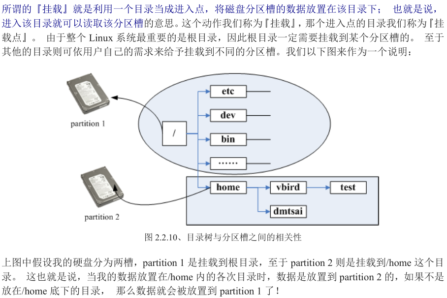
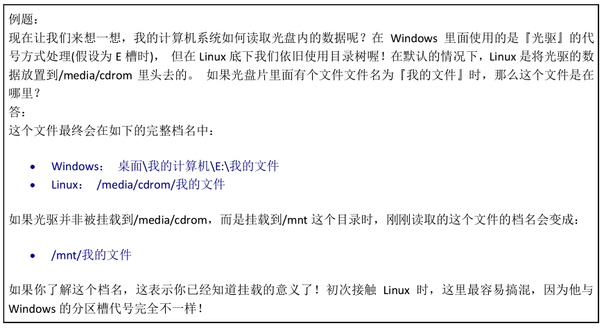

# ubuntu使用总结

## terminal终端

Ctrl+Alt+T：打开终端
Ctrl+C：终止当前任务
Ctrl+D：关闭终端
Shift+Ctrl+C：复制
Shift+Ctrl+V：粘贴
clear或Ctrl+L：清除屏幕


## root用户和普通用户的切换

默认安装完成之后并不知道root用户的密码，那么如何应用root权限呢？

(1)sudo 命令  

```
xzm@ubuntu:~$  sudo
```

这样输入当前管理员用户密码就可以得到超级用户的权限。但默认的情况下5分钟root权限就失效了。

(2)sudo -i

```
xzm@ubuntu:~$  sudo -i
```

通过这种方法输入当前管理员用户的密码就可以进到root用户。

(3)如果想一直使用root权限，要通过su切换到root用户。

那我们首先要重设置root用户的密码：

```
xzm@ubuntu:~$  sudo passwd root
```

这样就可以设置root用户的密码了。

(4)之后就可以自由的切换到root用户了

```
xzm@ubuntu:~$  su
```

输入root用户的密码即可。

su "king" 或者 exit回到用户权限


## 使用技巧

- 使用shell的Tab键可以自动补全命令
- shell会记录用户执行命令的历史记录，而我们一般使用命令都会在短时间内集中反复使用，因此当你需要使用一条刚才还使用过的命令时，不需再次花时间输入，只要按下键盘上下箭头按键，就可实现上下翻页，翻出刚才用过的命令，直接回车执行。就好像电话机的通话记录和快速回拨一样。


## 桌面

Alt+F4：关闭窗口
print：桌面截图
win：搜索


# ————————————————


# Linux文件系统和目录结构

## 文件系统简介

在Linux操作系统中，所有被操作系统管理的资源，例如网络接口卡、磁盘驱动器、打印机、输入输出设备、普通文件或是目录都被看作是一个文件。

也就是说在LINUX系统中有一个重要的概念：一切都是文件。其实这是UNIX哲学的一个体现，而Linux是重写UNIX而来，所以这个概念也就传承了下来。在UNIX系统中，把一切资源都看作是文件，包括硬件设备。UNIX系统把每个硬件都看成是一个文件，通常称为设备文件，这样用户就可以用读写文件的方式实现对硬件的访问。


## 隐藏文件

Linux中隐藏文件特点是文件名以.开头，跟文件属性无关。在Linux中查看隐藏文件用ls -a命令（普通显示ls）


## 目录结构及简介

为了使不同 Linux 发行版本的目录结构保持一致性，Filesystem Hierarchy Standard (FHS) 规定了 Linux 的目录结构。最基础的三个目录如下：

- / (root, 根目录)
- /usr (unix software resource)：所有系统默认软件都会安装到这个目录；
- /var (variable)：存放系统或程序运行过程中的数据文件。


**常见目录说明：**
/bin： 存放二进制可执行文件(ls,cat,mkdir等)，常用命令一般都在这里；
/etc： 存放系统管理和配置文件；
/home： 存放所有用户文件的根目录，是用户主目录的基点，比如用户user的主目录就是/home/user，可以
用~user表示；
/usr ： 用于存放系统应用程序；
/opt： 额外安装的可选应用程序包所放置的位置。一般情况下，我们可以把tomcat等都安装到这里；
/proc： 虚拟文件系统目录，是系统内存的映射。可直接访问这个目录来获取系统信息；
/root： 超级用户（系统管理员）的主目录（特权阶级^o^）；
/sbin: 存放二进制可执行文件，只有root才能访问。这里存放的是系统管理员使用的系统级别的管理命令和程
序。如ifconfig等；
/dev： 用于存放设备文件；
/mnt： 系统管理员安装临时文件系统的安装点，系统提供这个目录是让用户临时挂载其他的文件系统；
/boot： 存放用于系统引导时使用的各种文件；
/lib ： 存放着和系统运行相关的库文件 ；
/tmp： 用于存放各种临时文件，是公用的临时文件存储点；
/var： 用于存放运行时需要改变数据的文件，也是某些大文件的溢出区，比方说各种服务的日志文件（系统启
动日志等。）等；
/lost+found： 这个目录平时是空的，系统非正常关机而留下“无家可归”的文件（windows下叫什么.chk）就在
这里


## 关于挂载






# 相对路径与绝对路径

什么是路径：路径是用来标识一个文件在操作系统的文件系统中存储位置的。pathname
> 举例：
> 全路径（pathname）D:\winshare\enum.c
> 路径（path）D:\winshare			 	
> 文件名（name）enum.c				

**绝对路径：**路径是从绝对位置开始的。譬如Windows中从某一个盘符开始（C:\），linux中从根目录/开始
**相对路径：**指明路径的时候，是从当前所在的位置开始的。

> 举例：
> D:\我的文档\123\123.txt
> D:\我的文档\abc\abc.txt
> 当前在123.txt，但是要去abc.txt
> 方式1：采用绝对路径。D:\我的文档\abc\abc.txt
> 方式2：采用相对路径。../abc/abc.txt
> 从当前路径开始，往上走一层，再往下走一层（abc）就到了

> 测试：
> /abc/123/def.txt	是linux绝对路径	
> abc/123/def.txt		不是linux绝对路径
> F:\abc\123\def.txt	是windows绝对路径
> abc\123\def.txt		不是windows绝对路径


# Linux命令行中一些符号的含义

`.` 代表当前目录

`..  `代表上一层目录，当前目录的父目录

`-`代表前一个目录，我刚才从哪个目录cd过来

`~  `代表当前用户的宿主目录

`/  `代表根目录

`#`root用户的命令行提示符

 `$ ` 普通用户的命令行提示符

`*`万能匹配符

> 宿主目录：所谓宿主目录，就是操作系统为当前用户所设计的用来存放文件、工作的默认目录。如Windows中的“我的文档”目录，就是Windows为我们设计的宿主目录。Linux中每个用户都有自己的宿主目录，这个目录对于普通用户来说，在/home/username/，而对于root用户来说，在/root。


# Linux常用命令

## ls（list，列表）
作用：使用列表把当前文件夹下所有文件显示出来

> ls -a	显示所有文件，包括隐藏文件
> ls -l	以详细信息显示
> ls -a -l
> ls -l -a
> ls -la
> ls -al	四种方式都是可以的(**可以简写为ll**)

> ls -l显示的详细信息中：
> -rw-r--r--
> drwxr-xr-x
> 一共10个字符，第一个字符表示文件类型，后面9个字符表示文件权限。
> 文件类型：
> "-" 表示普通文件。普通文件指文本文件和二进制文件，如a.c  1.txt a.out都是普通文件
> d 表示文件夹，d是directory的缩写
> l 表示符号连接文件，后面会用->打印出它指向的文件
> s 表示socket文件
> p 表示管道文件 pipe

## cd（change directory，更改目录）
作用：用来切换目录
涉及到相对路径和绝对路径 
> cd ..		
> ..代表上一层目录
> .代表当前目录

## pwd（print work directory，打印工作目录）
作用：打印出当前的绝对路径

## mkdir（make directory，创建文件夹）
作用：创建空文件夹
> mkdir -p 级联创建文件夹

## mv（move，移动）
作用：在目录间移动文件，重命名文件
> mv 源文件pathname 目的文件pathname

## touch
作用：创建空文件
> touch pathname

## cp（copy，复制）
作用：复制文件或文件夹
> cp 源文件pathname 目标文件pathname
> cp -r 用来复制文件夹
> cp -f 强制复制
> 实际操作时，一般都是cp -f复制文件，
> cp -rf复制文件夹

## rm（remove，去除，删除）
作用：用来删除文件，文件夹
> rm 文件pathname
> rm -r 文件夹pathname（递归删除）
> rm -f 文件（强制删除）

## cat
作用：直接在命令行下显示文件内容
	
## rmdir（remove directory，删除文件夹）
作用：删除空文件夹
> rmdir和rm -r的区别：rmdir只能删除空文件夹，而rm -r可以删除空文件夹和非空文件夹

## ln（link，连接文件）
基础：windows中快捷方式，实际上快捷方式和它指向的文件是独立的两个文件，两个都占硬盘空间，只不过用户访问快捷方式时，其效果等同于访问指向的文件。		

linux中有两种连接文件：
一种叫软连接（符号连接），等同于windows中快捷方式
一种叫硬连接
创建软连接文件： ln -s 源文件名 符号连接文件名
> 举例：ln -s src.c，linker.c，	linker.c就是src.c的一个符号连接文件

硬连接：ln 源文件名 连接文件名
> 硬连接实际上和源文件在硬盘中是同一个东西，效果类似于硬盘上的一个文件，在文件系统上，在我们看来有好多个文件一样。每次删除一个文件时，只要他还有其他的硬连接存在，这个文件就不会被真正删除。只有等所有的连接文件都删除掉了，这个文件才会被真正从硬盘上删除。

## man
作用：查询man手册，获得帮助信息
> man 1 ls		1表示查询的是linux命令
> man 2 xxx		2表示查询的是linux api
> man 3 xxx		3表示查询的是C库函数
> 注意：在man手册中查询时，退出按Q键（Q就是quit的缩写）

## apt-get
作用：在ubuntu中用来在线安装、卸载软件的程序
> apt-get install vim
> apt-get remove vim
> 注意，安装和卸载都是在线的，也就是说ubuntu必须能上网才能使用apt-get 

**说明：**apt-get 安装软件的原理和必要性。
linux操作系统的发行版，内核版本，定制性，造成了linux中软件的不兼容性。在linux中安装软件是一件困难的事情，装了软件能不能用不一定。ubuntu解决了这个问题，ubuntu就适合某个发行版（ubuntu10.04）的所有软件做了一个列表，然后用户通过apt-get install的方式安装软件，就会实时连接到ubuntu服务器，服务器会根据你的ubuntu版本，给你下载合适的软件来安装。这样确保了软件的兼容性。


# 网络通讯命令

## ifconfig  显示或设置网络设备

- ifconfig  显示网络设备
- ifconfig eth0 up 启用eth0网卡
- ifconfig eth0 down  停用eth0网卡
- ifconfig eth0 192.168.1.100 临时指定私有ip

## ping   探测网络是否通畅

- ping 192.168.0.1

## netstat 查看网络端口

- netstat -an | grep 3306 查询3306端口占用情况

## 网络启闭指令

`/etc/init.d/network restart` 这个 script 最重要！因为可以一口气重新启动整个网络的参
数！ 他会主动的去读取所有的网络配置文件，所以可以很快的恢复系统默认的参数值。

`ifup eth0 (ifdown eth0)` 或ifconfig eth0 up（down）启动或者是关闭某张网络接口。


# 系统管理命令

## df 显示磁盘信息

- df –h  友好显示大小

- free 显示内存状态

## clear 清屏幕

## ps 正在运行的某个进程的状态

- ps –ef  查看所有进程

- ps –ef | grep ssh 查找某一进程

## kill 杀掉某一进程

- kill 2868  杀掉2868编号的进程

- kill -9 2868  强制杀死进程

## who 显示目前登入系统的用户信息

## hostname 查看当前主机名

## uname 显示系统信息

- uname -a 显示本机详细信息。

> 依次为：内核名称(类别)，主机名，内核版本号，内核版本，内核编译日期，硬件名，处理器类型，硬件平台类型，操作系统名称


## 开机和关机

shutdown -h now		立即关机
init 0				关机
shutdown -r now		立即重启
reboot				重启


# 编辑器vi的使用
---
> 什么是编辑器？编辑器就是一款软件，它的主要作用就是用来编辑。譬如编写文件，编写代码。
> Windows中的常用编辑器，如自带的notepad。比较好用的notepad++，UltraEditor，SlickEditor
> Linux中常用编辑器，自带的最古老的vi。比较好用的vim，gedit。
> 注：vi和vim的关系：vim是vi的升级版，推荐使用vim。
> 我们在后面提到vi时，其实都是指vim。

## vi基础使用
使用vi来打开/创建一个文件
> vi pathname

**vi的两种模式：**
命令模式：当vi打开时默认为命令模式，要转入输入模式，**需要按a或者i键。**在命令模式下，键盘上输入的所有东西都被vi当作命令来对待。在输入模式下**按ESC键退回**到命令模式。

> 在命令模式下，最好不要乱输入。此时应该输入相应的命令，来让vi做相应的事。
> 输入模式：输入模式用来向文件输入内容。可以从命令模式中按a或者i进入输入模式。进入输入模式后，就可以随意按键盘进行输入了。输入完成后如果要保存，要先退回到命令模式（因为保存也是一种命令）。
> <br/>注：注意看屏幕左下角，当命令模式时无提示信息或者提示文件名等信息，等处于输入模式时，提示 -- INSERT --

在命令模式下如何保存：
:wq			保存并且退出
:w			只保存不推出
:q			不保存退出		进来看了一下没改退出
:q!			不保存强制退出
:wq!		保存并强制退出

## vi的高级使用
### 查找
在命令模式下，输入/xxx，就可以查找到xxx

### 快速切换行
在命令模式下，输入:num，就可以快速切换到num行

### 设置显示行号
在命令模式下，输入:set nu，就可以显示行号
> 注：设置不显示行号，命令模式输入:set nonu
> 设置永久显示行号，需要修改vi的配置文件。打开vi的配置文件~/.vimrc，在其中输入set nu即可。

### 行删除
命令模式下，先将光标移动到要删除的行，然后输入dd
如果要删除连续多行，譬如要删除连续的3行，使用3dd 

### 行复制粘贴
复制：命令模式下，nyy
粘贴：命令模式下，p
> 细节，复制时要把光标放在多行的第一行，粘贴时实际粘贴到当前光标所在行的下一行。

# linux中用户和权限管理

## 普通用户与特权用户 
> su命令切换用户

Windows中有普通用户和特权用户，特权用户是Administrator，普通用户可以有很多个。
特权用户是系统的管理员，对系统内所有文件具有操作权限。每个普通用户只能处理自己的文件，不能访问其他用户的文件，更不能随意处理操作系统的文件。
Linux中也有普通用户和特权用户的区别。特权用户就是root用户。普通用户权限受到限制，譬如说普通用户不能cd /root，普通用户不能使用apt-get install 来装软件。	

**可以使用su 用户名来在不同用户间切换。譬如要从普通用户切换到root，可以su root，然后输入root的密码即可转入root用户。从root要切换到普通用户gec，则su gec即可。**


## 用户管理

useradd user1	添加一个名为user1的用户
userdel	user1	删除一个名为user1的用户
passwd user1	为名为user的用户设置密码
adduser user1	添加一个名为user1的用户，同时创建宿主目录，用户shell等。
**adduser和useradd的区别：**
adduser是一个脚本，而useradd是一个二进制应用程序。adduser创建用户时比较麻烦，但是一次设定完所有的信息；而useradd设置时简单，但是需要额外的设置宿主目录，密码那些信息。


## 权限管理

作用：用来管理系统中文件的权限。
	chmod （change mode）修改文件权限，比较常用，要记得
	chown （change owner，修改属主）
	chgrp （change group，修改文件的组）
	
ls -l 列出的属性，显示详细信息
-rwxr-xr-x
一共10个字符，第一个表示文件属性（d表示文件夹，-表示普通文件），剩下的9个分成三组。每组中三个分别表示r可读w可写x可执行。如果是字母表示有这个权限，如果是-表示没这个权限。三组分别表示：第一组表示文件属主的权限，第二组表示属主所在的组用户的权限，第三组表示其他用户的权限。

权限还有另一种表示方法，用数字来表示。
编码规则如下：
r	可读		4
w	可写		2
x	可执行		1
-无权限		0

有了这个编码规则，则 rwxr-xr-x  编码后为755

第一种修改权限的方法：
要把权限改成	rwxr--r--	则对应的编码值为744
修改命令为：chmod 744 文件名

第二种修改权限的方法：
在原来的权限基础上进行修改，即增加或减少某权限。
三个组用户的编码依次为： 属主u	属主所在的组g	其他用户o
譬如
要属主增加可执行权限	chmod u+x 文件名
其他用户增加可写权限	chmod o+w 文件名
属主所在组用户去掉可执行权限	chmod g-x 文件名 

# 进阶
---
## find
功能：在linux文件系统中，用来查找一个文件放在哪里了。
举例：find /etc -name "interfaces"
总结：
(1)什么时候用find？ 
当你知道你要找的文件名，但是你忘记了它被放在哪个目录下，要找到该文件时，用find。
(2)怎么用find？
**find 路径 -name "文件名"**

## grep
功能：在一个文本文件中，查找某个词。
举例：grep -nr "SUN" *
总结：
(1)什么时候用grep？
当你想查找某个符号在哪些地方（有可能是一个文件，也有可能是多个文件组成的文件夹）出现过，就用grep
(2)怎么用？
	grep -nr "要查找的符号" 要查找的目录或文件集合
注意：-n表示查找结果中显示行号，-r表示要递归查找

## which和whereis
功能：查找一个**应用程序（二进制文件）**在哪里
举例：which ls 		whereis ls
区别
	which只显示二进制文件的路径
	whereis显示二进制文件的路径，和其源码或man手册位置


## tree/lstree	
功能：显示文件和目录由根目录开始的树形结构
	
## mount/umount
功能：用来挂载磁盘到文件系统中
举例：mount -t nfs -o nolock 192.168.1.141:/root/rootfs /mnt	挂载
	  umount /mnt 卸载


## 磁盘空间相关
df -h	显示已挂载的分区列表
du -h	列出文件或文件夹的大小
du -h 文件名，可以列出这个文件有多大，列出方式是以人比较好看懂的方式。不像 ls -l列出的都是以字节为单位。


​	
​	


​	
## 文件打包压缩与解压缩
tar -czvf dir.tar.gz dir/		将dir目录打包成dir.tar.gz
tar -cjvf dir.tar.bz2 dir/		将dir目录打包成dir.tar.bz2
tar -zxvf dir.tar.gz 			解压缩dir.tar.gz
tar -jxvf dir.tar.bz2			解压缩dir.tar.bz2
	
	
## sed和awk
正则表达式。匹配加替换。


## 格式化文件系统
mkfs	/dev/hd1
mkfs -t vfat 32 -F /dev/hd1		创建一个FAT32文件系统


# ——————————————————

​	

# GNU和Linux发行版（Linux操作系统）	

**GNU**

GNU是一个自由的操作系统，其内容软件完全以GPL方式发布。这个操作系统是GNU计划的主要目标，名称来自GNU's Not Unix!的递归缩写，因为GNU的设计类似Unix，但它不包含具著作权的Unix代码。GNU的创始人，理查德·马修·斯托曼，将GNU视为“达成社会目的技术方法”。

作为操作系统，GNU的发展仍未完成，其中最大的问题是具有完备功能的内核尚未被开发成功。GNU的内核，称为Hurd，是自由软件基金会发展的重点，但是其发展尚未成熟。在实际使用上，多半使用Linux内核、FreeBSD等替代方案，作为系统核心，其中主要的操作系统是Linux的发行版。Linux操作系统包涵了Linux内核与其他自由软件项目中的GNU组件和软件，可以被称为GNU/Linux。

**Linux发行版**

我们通常所说的Linux，准确来说应该叫linux操作系统，指GNU/Linux，即采用Linux内核的GNU操作系统。

就Linux的本质来说，它只是操作系统的核心，负责控制硬件、管理文件系统、程序进程等，并不给用户提供各种工具和应用软件。所谓工欲善其事，被必先利其器，一套在优秀的操作系统核心，若没有强大的应用软件可以使用，如C/C++编译器、C/C++库、系统管理工具、网络工具、办公软件、多媒体软件、绘图软件等，也无法发挥它强大的功能，用户也无法仅仅使用这个系统核心进行工作，因此人们以Linux核心为中心，再集成搭配各种各样的系统管理软件或应用工具软件组成一套完整的操作系统，如此的组合便称为Linux发行版。


# VMware Tools：Ubuntu实现和windows复制粘贴

1.安装说明

最近想实现虚拟机和windows互联实现赋值粘贴功能，但是网上参考的贴图都是虚拟windows操作系统实例，让我走了不少弯路。实际上，做法一样，本人理解错了。下面介绍一下本人的实践，操作实现虚拟机VMware上Linux与windows互相自由复制与粘贴，可以让我们工作学习方便很多。

2.搭配环境：

本次实验的环境是：

主机win7系统；

虚拟机VMware9.02上运行的ubuntu14.04（linux）系统；

版本环境不同没关系，操作一样。

3.解决方法

只需要在ubuntu安装一个vmware-tools的工具。具体实现如下：

①.打开虚拟机的菜单中文为“虚拟机”，英文是“VM”，下拉框中会有一个Install vmware tools 工具的安装选项。


②.点击之后，在CD-ROM中生成在ubuntu的桌面下会出现 VMwareTools-9.2.3-1031360.tar.gz 的文件（你的版本号跟我不同，内容一样），当前为路径（/media/VMware Tools）。

③.将此文件复制到随便文件下进行解压，本人如下操作：

cp VMwareTools-9.2.3-1031360.tar.gz /tmp

cd/tmp

tar -xzvf VMwareTools-9.2.3-1031360.tar.gz

当然自己手动操作也一样的道理，文件拷贝的路径不同也没影响。

④.这是会出现解压后的目录( vmware-tools-distrib目录）。然后执行编译操作。然后打开命令窗到指定安装包路径，执行：

sudo ./vmware-install.pl

最好根权限运行，以防无法编译。

开始进行安装，遇到什么提醒默认设置即可，一路回车。如果执行过程中出现“…致命错误：Linux/smp_lock.h没有那个文件或目录，编译中断….”的错误，不用理会只管一路回车即可。

⑤.安装完成提醒：

Enjoy,

–the VMware team

⑥.重新启动ubuntu系统，大功告成。

4.特别提醒

特别提醒，windows上拖拽功能，如果想让虚拟机和windows上实现，只能在两个环境的桌面上实现拖拽。而不可以从其他目录下操作。其他目录下仅能完成手动复制粘贴。


本文永久更新地址：[http://www.linuxdiyf.com/linux/25870.html](http://www.linuxdiyf.com/linux/25870.html)1.安装说明

最近想实现虚拟机和windows互联实现赋值粘贴功能，但是网上参考的贴图都是虚拟windows操作系统实例，让我走了不少弯路。实际上，做法一样，本人理解错了。下面介绍一下本人的实践，操作实现虚拟机VMware上Linux与windows互相自由复制与粘贴，可以让我们工作学习方便很多。

2.搭配环境：

本次实验的环境是：

主机win7系统；

虚拟机VMware9.02上运行的ubuntu14.04（linux）系统；

版本环境不同没关系，操作一样。

3.解决方法

只需要在ubuntu安装一个vmware-tools的工具。具体实现如下：

①.打开虚拟机的菜单中文为“虚拟机”，英文是“VM”，下拉框中会有一个Install vmware tools 工具的安装选项。


②.点击之后，在CD-ROM中生成在ubuntu的桌面下会出现 VMwareTools-9.2.3-1031360.tar.gz 的文件（你的版本号跟我不同，内容一样），当前为路径（/media/VMware Tools）。

③.将此文件复制到随便文件下进行解压，本人如下操作：

cp VMwareTools-9.2.3-1031360.tar.gz /tmp

cd/tmp

tar -xzvf VMwareTools-9.2.3-1031360.tar.gz

当然自己手动操作也一样的道理，文件拷贝的路径不同也没影响。

④.这是会出现解压后的目录( vmware-tools-distrib目录）。然后执行编译操作。然后打开命令窗到指定安装包路径，执行：

sudo ./vmware-install.pl

最好根权限运行，以防无法编译。

开始进行安装，遇到什么提醒默认设置即可，一路回车。如果执行过程中出现“…致命错误：Linux/smp_lock.h没有那个文件或目录，编译中断….”的错误，不用理会只管一路回车即可。

⑤.安装完成提醒：

Enjoy,

–the VMware team

⑥.重新启动ubuntu系统，大功告成。

4.特别提醒

特别提醒，windows上拖拽功能，如果想让虚拟机和windows上实现，只能在两个环境的桌面上实现拖拽。而不可以从其他目录下操作。其他目录下仅能完成手动复制粘贴。


本文永久更新地址：[http://www.linuxdiyf.com/linux/25870.html](http://www.linuxdiyf.com/linux/25870.html)


# Linux系统和windows系统的区别

**1.免费与收费**

- 正版windows收费；
- Linux 免费或少许费用。

**2.软件与支持**

- Windows 平台:数量和质量的优势，不过大部分为收费软件；由微软官方提供重要支持和服务；
- Linux 平台：大都为开源自由软件，用户可以修改定制和再发布，由于基本免费没有资金支持，部分软件质量和体验欠缺；有全球所有的 Linux 开发者和自由软件社区提供支持。

**3.安全性**

- Windows 平台：三天两头打补丁安装系统安全更新，还是会中病毒木马；
- Linux 平台：要说 Linux 没有安全问题，那当然是不可能的，这一点仁者见仁智者见智，相对来说肯定比 Windows 平台要更加安全，使用 Linux 你也不用装某杀毒，某毒霸。

**4.使用习惯**

- Windows：普通用户基本都是纯图形界面下操作使用，依靠鼠标和键盘完成一切操作，用户上手容易入门简单；
- Linux：兼具图形界面操作（需要使用带有桌面环境的发行版）和完全的命令行操作，可以只用键盘完成一切操作，新手入门较困难，需要一些学习和指导（这正是我们要做的事情），一旦熟练之后效率极高。

**5.可定制性**

- Windows：这些年之前算是全封闭的,系统可定制性很差；
- Linux：你想怎么做就怎么做，Windows 能做到得它都能，Windows 做不到的，它也能。

**6.应用范畴**

或许你之前不知道 Linux ，要知道，你之前在 Windows 使用百度，谷歌，上淘宝，聊 QQ 时，支撑这些软件和服务的，是后台成千上万的 Linux 服务器主机，它们时时刻刻都在进行着忙碌的数据处理和运算，可以说世界上大部分软件和服务都是运行在 Linux 之上的。

**7.Windows 没有的**

稳定的系统
安全性和漏洞的快速修补
多用户
用户和用户组的规划
相对较少的系统资源占用
可定制裁剪，移植到嵌入式平台（如安卓设备）
可选择的多种图形用户界面（如 GNOME，KDE）

**8.Linux 没有的**

没有特定的支持厂商
游戏娱乐支持度不足
专业软件支持度不足

