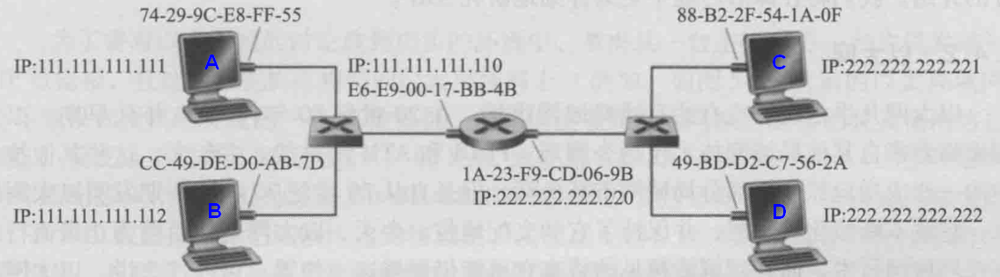
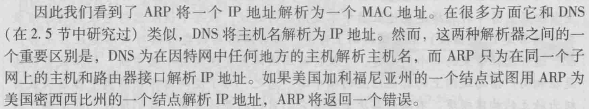
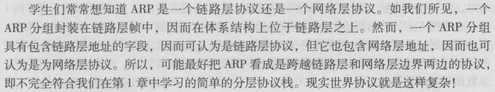
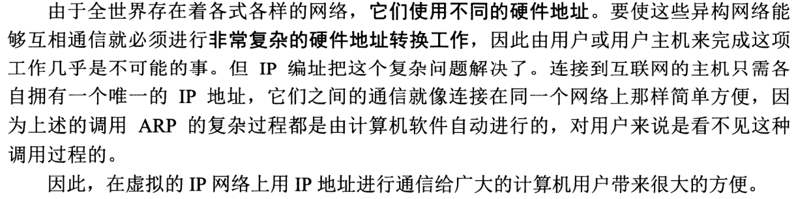
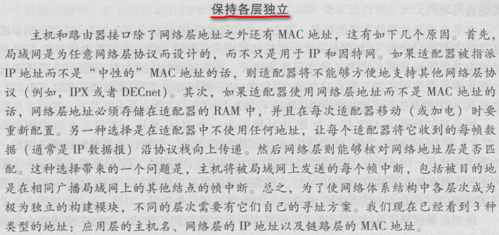

## TCP/IP中，每一层对应的协议

网络层：IP协议、ICMP协议、ARP协议、RARP协议。

传输层：UDP协议、TCP协议。

应用层：FTP（文件传送协议）、Telenet（远程登录协议）、DNS（域名解析协议）、SMTP（邮件传送协议），POP3协议（邮局协议），HTTP协议。

## TCP和UDP的区别

UDP首部开销小，只有8个字节，所以UDP用户数据报最小长度为8字节；  而TCP首部至少20个字节（固定字节20+可变字段）

TCP是面向连接的，UDP是无连接的；

TCP是可靠的，UDP是不可靠的；

TCP只支持点对点通信；UDP支持一对一、一对多、多对一、多对多的通信模式；

TCP是面向字节流的；UDP是面向报文的；

TCP有拥塞控制机制；UDP没有拥塞控制，适合媒体通信

## TCP对应的协议和UDP对应的协议

**TCP对应的协议：**

（1）**FTP**：定义了文件传输协议，使用21端口。常说某某计算机开了FTP服务便是启动了文件传输服务。下载文件，上传主页，都要用到FTP服务。

（2）**Telnet**：它是一种用于远程登陆的端口，用户可以以自己的身份远程连接到计算机上，通过这种端口可以提供一种基于DOS模式下的通信服务。如以前的BBS是-纯字符界面的，支持BBS的服务器将23端口打开，对外提供服务。

（3） **SMTP**：定义了简单邮件传送协议，现在很多邮件服务器都用的是这个协议，用于发送邮件。如常见的免费邮件服务中用的就是这个邮件服务端口，所以在电子邮件设置-中常看到有这么SMTP端口设置这个栏，服务器开放的是25号端口。

（4） **POP3**：它是和SMTP对应，POP3用于接收邮件。通常情况下，POP3协议所用的是110端口。也是说，只要你有相应的使用POP3协议的程序（例如Fo-xmail或Outlook），就可以不以Web方式登陆进邮箱界面，直接用邮件程序就可以收到邮件（如是163邮箱就没有必要先进入网易网站，再进入自己的邮-箱来收信）。

（5）**HTTP协议**：是从Web服务器传输超文本到本地浏览器的传送协议。

**UDP对应的协议：**

（1） **DNS**：用于域名解析服务，将域名地址转换为IP地址。DNS用的是53号端口。

（2） **SNMP**：简单网络管理协议，使用161号端口，是用来管理网络设备的。由于网络设备很多，无连接的服务就体现出其优势。

（3） **TFTP**(Trival File Transfer Protocal)，简单文件传输协议，该协议在熟知端口69上使用UDP服务。

## 三次握手和四次挥手

 

## 为什么TCP链接需要三次握手，两次不可以么，为什么？

 

## TCP协议如何来保证传输的可靠性

 

## TCP的拥塞处理

 

## **在浏览器中输入[www.baidu.com](http://www.baidu.com/)后执行的全部过程**

？

## ARP协议的工作原理 √

地址解析协议（ARP）的任务是提供目的IP地址和目的MAC地址之间的映射。需要注意的是ARP只为在同一个子网上的主机和路由器端口的IP地址和MAC地址提供转换服务，对于源IP地址和目的IP地址不在同一子网的ARP请求，ARP将返回一个错误。与之相对应的协议称逆地址解析协议（RARP），提供MAC到IP的转换，但RARP目前已被DHCP取代。

为阐述ARP的工作机理，我们将通信分为子网内通信（如A和B通信）和子网间通信（如A和C通信）两种情形。

- 同一子网内两台主机通信

  假设主机A要向主机B发送消息，此时A在网络层发送出去的IP数据报中含有目的主机的IP地址，但此时IP数据报将被交付到数据链路层封装成帧，若要将通信继续下去，主机A需要提供目的主机的MAC地址，**这时候ARP协议就开始起作用了**。为了获得目的IP地址对应的MAC地址，主机A将首先从缓存在其内存中的ARP表（该表中存放着IP地址和MAC地址的映射）中查找是否存在目的IP地址项，**若存在**，则将其对应的MAC地址写入MAC帧继续通信过程；**若不存在**，主机A将发送一个ARP分组，其目的MAC地址为MAC广播地址（FF-FF-FF-FF-FF-FF），内容主要是：我的IP地址是111.111.111.111，MAC地址74-29-9C-E8-FF-55，我想知道IP地址为111.111.111.112的主机的MAC地址。该子网上的其他主机或路由器收到该分组后，会检查IP地址111.111.111.112和自己的IP地址是否相符，若不相符将丢弃该分组，若相符，则响应一个带有自己IP地址和MAC地址的分组。主机A收到响应分组后就知道了目的IP地址的MAC地址（同时将该对应关系存入自己ARP表中，一个记录通常的保存时间是20分钟），此时通信又可以继续下去了。

- 不同子网内两台主机通信

  假设主机A要向主机C发送消息，此时没有办法直接获取主机C的MAC地址，因为ARP只在子网内通信时起作用。为了完成通信，消息需要通过路由器（IP为111.111.111.110）这个网关转发消息出去。网关，简单理解就是提供网络接入的设备或端口。主机A上有网关IP地址的信息，为111.111.111.110。所以通过查ARP表或广播ARP分组，主机A就可以获得IP地址为111.111.111.110的路由器端口的MAC地址，借助该MAC地址，主机就可将信息转发给该路由器端口，随后消息转发任务就交给该路由器来执行。

**DNS和ARP的一个不同之处**

## ARP协议是网络层协议还是数据链路层协议？√

## 为什么既要IP地址，又要MAC地址？√

## 路由设备与相关层

物理层：中继器（Repeater，也叫放大器），集线器。

数据链路层：网桥，交换机。

网络层：路由器。

## 常见的路由选择协议，以及它们的区别

常见的路由选择协议有：RIP协议、OSPF协议。

**RIP协议**：底层是贝尔曼福特算法，它选择路由的度量标准（metric)是跳数，最大跳数是15跳，如果大于15跳，它就会丢弃数据包。

**OSPF协议**：底层是迪杰斯特拉算法，是链路状态路由选择协议，它选择路由的度量标准是带宽，延迟。

1、客户端浏览器通过DNS解析到[www.baidu.com](www.baidu.com)的IP地址220.181.27.48，通过这个IP地址找到客户端到服务器的路径。客户端浏览器发起一个HTTP会话到220.161.27.48，然后通过TCP进行封装数据包，输入到网络层。

2、在客户端的传输层，把HTTP会话请求分成报文段，添加源和目的端口，如服务器使用80端口监听客户端的请求，客户端由系统随机选择一个端口如5000，与服务器进行交换，服务器把相应的请求返回给客户端的5000端口。然后使用IP层的IP地址查找目的端。

3、客户端的网络层不用关系应用层或者传输层的东西，主要做的是通过查找路由表确定如何到达服务器，期间可能经过多个路由器，这些都是由路由器来完成的工作，我不作过多的描述，无非就是通过查找路由表决定通过那个路径到达服务器。

4、客户端的链路层，包通过链路层发送到路由器，通过邻居协议查找给定IP地址的MAC地址，然后发送ARP请求查找目的地址，如果得到回应后就可以使用ARP的请求应答交换的IP数据包现在就可以传输了，然后发送IP数据包到达服务器的地址。

## 特殊的IP地址

（1）网络地址

IP地址由网络号（包括子网号）和主机号组成，网络地址的主机号为全0，网络地址代表着整个网络。

（2）广播地址

广播地址通常称为直接广播地址，是为了区分受限广播地址。

广播地址与网络地址的主机号正好相反，广播地址中，主机号为全1。当向某个网络的广播地址发送消息时，该网络内的所有主机都能收到该广播消息。

（3）组播地址

D类地址就是组播地址。

先回忆下A，B，C，D类地址吧

A类地址以00开头，第一个字节作为网络号，地址范围为：0.0.0.0~127.255.255.255；

B类地址以10开头，前两个字节作为网络号，地址范围是：128.0.0.0~191.255.255.255;

C类地址以110开头，前三个字节作为网络号，地址范围是：192.0.0.0~223.255.255.255。

D类地址以1110开头，地址范围是224.0.0.0~239.255.255.255，D类地址作为组播地址（一对多的通信）；

E类地址以1111开头，地址范围是240.0.0.0~255.255.255.255，E类地址为保留地址，供以后使用。

Notice：只有A,B,C有网络号和主机号之分，D类地址和E类地址没有划分网络号和主机号。

（4）255.255.255.255

该IP地址指的是受限的广播地址。受限广播地址与一般广播地址（直接广播地址）的区别在于，受限广播地址之只能用于本地网络，路由器不会转发以受限广播地址为目的地址的分组；一般广播地址既可在本地广播，也可跨网段广播。例如：主机192.168.1.1/30上的直接广播数据包后，另外一个网段192.168.1.5/30也能收到该数据报；若发送受限广播数据报，则不能收到。

Notice：一般的广播地址（直接广播地址）能够通过某些路由器（当然不是所有的路由器），而受限的广播地址不能通过路由器。

（5）0.0.0.0

常用于寻找自己的IP地址，例如在我们的RARP，BOOTP和DHCP协议中，若某个未知IP地址的无盘机想要知道自己的IP地址，它就以255.255.255.255为目的地址，向本地范围（具体而言是被各个路由器屏蔽的范围内）的服务器发送IP请求分组。

（6）回环地址

127.0.0.0/8被用作回环地址，回环地址表示本机的地址，常用于对本机的测试，用的最多的是127.0.0.1。

（7）A、B、C类私有地址

私有地址(private address)也叫专用地址，它们不会在全球使用，只具有本地意义。

A类私有地址：10.0.0.0/8，范围是：10.0.0.0~10.255.255.255

B类私有地址：172.16.0.0/12，范围是：172.16.0.0~172.31.255.255

C类私有地址：192.168.0.0/16，范围是：192.168.0.0~192.168.255.255

## HTTP协议包括哪些请求？

GET：请求读取由URL所标志的信息。

POST：给服务器添加信息（如注释）。

PUT：在给定的URL下存储一个文档。

DELETE：删除给定的URL所标志的资源。

## HTTP中，POST与GET的区别

(1)Get是从服务器上获取数据，Post是向服务器传送数据。

(2)Get是把参数数据队列加到提交表单的Action属性所指向的URL中，值和表单内各个字段一一对应，在URL中科院看到。

(3)Get传送的数据量小，不能大于2KB；post传送的数据量较大，一般被默认为不受限制。

(4)根据HTTP规范，GET用于信息获取，而且应该是安全的和幂等的。

I.所谓安全的意味着该操作用于获取信息而非修改信息。换句话说，GET 请求一般不应产生副作用。就是说，它仅仅是获取资源信息，就像数据库查询一样，不会修改，增加数据，不会影响资源的状态。

II.幂等的意味着对同一URL的多个请求应该返回同样的结果。

## NAT协议、DHCP协议、DNS协议的作用

**NAT协议**：网络地址转换(NAT,Network AddressTranslation)属接入广域网(WAN)技术，是一种将私有（保留）地址转化为合法IP地址的转换技术，它被广泛应用于各种类型Internet接入方式和各种类型的网络中。原因很简单，NAT不仅完美地解决了lP地址不足的问题，而且还能够有效地避免来自网络外部的攻击，隐藏并保护网络内部的计算机。

**DHCP协议**：动态主机设置协议（Dynamic Host ConfigurationProtocol, DHCP）是一个局域网的网络协议，使用UDP协议工作，主要有两个用途：给内部网络或网络服务供应商自动分配IP地址，给用户或者内部网络管理员作为对所有计算机作中央管理的手段。

**DNS协议**：DNS 是域名系统 (Domain Name System) 的缩写，是因特网的一项核心服务，它作为可以将域名和IP地址相互映射的一个分布式数据库，能够使人更方便的访问互联网，而不用去记住能够被机器直接读取的IP数串。

## ICMP 协议？

ICMP 是 Internet Control Message Protocol ，因特网控制报文协议。它是 TCP/IP 协议族的一个子协议，用于在 IP 主机、路由器之间传递控制消息。控制消息是指网络通不通、主机是否可达、路由器是否可用等网络本身的消息。这些控制消息虽然并不传输用户数据，但是对于用户数据的传递起着重要的作用。 ICMP 报文有两种：差错报告报文和询问报文。

## DNS （ Domain Name System ）域名系统工作原理。

当 DNS 客户机需要在程序中使用名称时，它会查询 DNS 服务器来解析该名称。客户机发送的每条查询信息包括三条信息：包括：指定的 DNS 域名，指定的查询类型， DNS 域名的指定类别。基于 UDP 服务，端口 53\. 该应用一般不直接为用户使用，而是为其他应用服务，如 HTTP ， SMTP 等在其中需要完成主机名到 IP 地址的转换。

## 请问交换机和路由器分别的实现原理是什么？分别在哪个层次上面实现的？

交换机用于局域网，利用主机的 MAC 地址进行数据传输，而不需要关心 IP 数据包中的 IP 地址，它工作于数据链路层。路由器识别网络是通过 IP 数据包中 IP 地址的网络号进行的，所以为了保证数据包路由的正确性，每个网络都必须有一个唯一的网络号。路由器通过 IP 数据包的 IP 地址进行路由的（将数据包递交给哪个下一跳路由器）。路由器工作于网络层。由于设备现在的发展，现在很多设备既具有交换又具有路由功能，两者的界限越来越模糊。

## 面向连接和非面向连接的服务的特点是什么？

面向连接的服务，通信双方在进行通信之前，要先在双方建立起一个完整的可以彼此沟通的通道，在通信过程中，整个连接的情况一直可以被实时地监控和管理。

非面向连接的服务，不需要预先建立一个联络两个通信节点的连接，需要通信的时候，发送节点就可以往网络上发送信息，让信息自主地在网络上去传，一般在传输的过程中不再加以监控。

## 电路交换、报文交换和分组交换的比较？

**电路交换**：公共电话网（ PSTN 网）和移动网（包括 GSM 和 CDMA 网） 采用的都是电路交换技术，它的基本特点是采用面向连接的方式，在双方进行通信之前，需要为通信双方分配一条具有固定宽带的通信电路，通信双方在通信过程中 一直占用所分配的资源，直到通信结束，并且在电路的建立和释放过程中都需要利用相关的信令协议。这种方式的优点是在通信过程中可以保证为用户提供足够的带 宽，并且实时性强，时延小，交换设备成本低，但同时带来的缺点是网络带宽利用率不高，一旦电路被建立不管通信双方是否处于通话状态分配的电路一直被占用。连接建立——数据传输——释放链接

**报文交换**：报文交换和分组交换类似，也采用存储转发机制，但报文交换是以报文作为传送单元，由于报文长度差异很大，长报文可能导致很大的时延，并且对每个节 点来说缓冲区的分配也比较困难，为了满足各种长度报文的需要并且达到高效的目的，节点需要分配不同大小的缓冲区，否则就有可能造成数据传送的失败。在实际 应用中报文交换主要用于传输报文较短，实时性要求较低的通信业务，如公用电报网，报文交换比分组交换出现的要早一些，分组交换是在报文交换的基础上，将报 文分割成分组进行传输，在传输时延和传输效率上进行了平衡。另外一个缺点是出错时，整个报文都将重传。

**分组交换**：电路交换技术主要适用于传送话音相关的业务，这种网络交换方式对于数据业务而言，有着很大的局限性。首先是数据通信具有较强的突发性，峰值比特率 和平均比特率相差较大，如果采用电路交换技术，若按峰值比特率分配电路带宽会造成资源的极大浪费，如果按平均比特率分配带宽，则会造成数据的大量丢失，其 次是和语音业务比较，数据业务对时延没有严格的要求，但是需要进行无差错的传输，而语音信号可以有一定程序的失真但实时性要高。分组交换技术就是针对数据 通信业务的特点而提出的一种交换方式，它的基本特点是面向无连接而采用存储转发的方式，将需要传送的数据按照一定长度分割成许多小段数据，并在数据之前增 加相应的用于对数据进行选路和校验等功能的头部字段，作为数据传送的基本单元，即分组。采用分组交换技术，在通信之前不需要建立连接，每个节点首先将前一 节点送来的分组收下并保存在缓冲区中，然后根据分组头部中的地址信息选择适当的链路将其发送至下一个节点，这样在通信过程中可以根据用户的要求和网络的能 力来动态分配带宽。分组交换比电路交换的电路利用率高，但时延较大。分组转发的带来的问题：带来排队时延以及增加头部带来的开销。

## 网络按地域范围分类？

局域网、城域网、广域网。

## 网络按使用者分类？

公共网和专用网。

## 数据链路层协议可能提供的服务？

成帧、链路访问、透明传输、可靠交付、流量控制、差错检测、差错纠正、半双工和全双工。最重要的是帧定界（成帧）、透明传输以及差错检测。

## 帧定界？

帧定界就是确定帧的界限，其方法有：字节计数法、字符填充法、零比特填充法。

## PPP 协议工作过程？

用户拨号接入 ISP ， ISP 的调制解调器对拨号做出确认，并建立一条物理链路，用户向 ISP 的路由器发送一系列的 LCP 分组，这是为 PPP 选择一些参数，然后配置网络层， NCP 为新接入的 PC 分配一个临时的 IP 地址，这样用户 PC 就成为因特网上的主机，通信结束后， NCP 释放网络层连接收回 IP 地址，然后， LCP 释放数据链路层连接，最后释放物理层的连接。

## CSMA/CD ？

是指载波监听多点接入 / 碰撞检测

（ 1 ）多点接入是指多台计算机以多点接入的方式连接在一条总线上

（ 2 ）载波监听是指每一个站在发送数据之前首先要检查一下总线上是否已经有其他计算机在发送数据，如果有，则暂时不要发送，避免碰撞

（ 3 ）实际在总线上并没有什么载波，实际是采用电子技术检测总线上是否有其他计算机发送的数据信号

（ 4 ）碰撞检测就是计算机边发送数据边检测信道上的信号电压大小，当发生了碰撞即产生了冲突，碰撞检测也叫做“冲突检测”

（ 5 ）当发生了碰撞时，总线上传输的信号就产生了失真，无法恢复出有用的信息，因此为了不浪费网络资源，一旦检测到碰撞发生时，就停止数据发送。然后再等待一段随机时间后在发送。

（ 6 ）强化碰撞，当检测到碰撞后，不仅立即停止发送数据外，还要人为的发送一些干扰信息，让其他站也知道此时碰撞发生了。

（ 7 ）由于信号在总线上的传输也是需要一定的时间的，所以当一个站检测到总线是空闲的时候，也可能并非是真正的空闲，因为会存在其他站发送了数据，只是还没有传送到该站能检测的范围内。这种情况下，发送数据最终也会导致碰撞发生。

（ 8 ）工作原理

（ 81 ）发送前先监听信道是否空闲，若空闲则立即发送；

（ 82 ）如果信道忙，则继续监听，一旦空闲就立即发送；

（ 83 ）在发送过程中，仍需继续监听。若监听到冲突，则立即停止发送数据，然后发送一串干扰信号（ Jam ）；

（ 84 ）发送 Jam 信号的目的是强化冲突，以便使所有的站点都能检测到发生了冲突。等待一段随机时间（称为退避）以后，再重新尝试。

总结为四句话：发前先听，空闲即发送，边发边听，冲突时退避。

## 虚拟局域网 VLAN ？

（ 1 ） VLAN 只是局域网提供给用户的一种服务，而并不是一种新的局域网络。 VLAN 限制了接收广播消息的工作站数，使得网络不会因传播过多的广播信息（即广播风暴）而引起性能恶化。

（ 2 ）划分 VLAN 的方法：基于端口；基于 MAC 地址；基于 IP 地址。

## 运输层协议与网络层协议的区别？

网络层协议负责的是提供主机间的逻辑通信

运输层协议负责的是提供进程间的逻辑通信